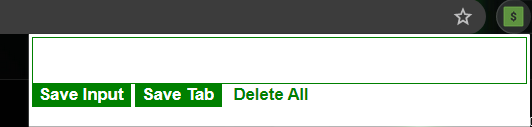

# Leads Tracker

## .........................Description........................

It's a chrome extension that can be used to store the daily Leads.
We can either make the input of a lead and save the input, or
we can also save the current tab .
It's helpful for those professionals who are into sales and networking
and can have the leads for the day.

## ....................Project-Demo............................

We can provide our lead input in the input tab and press
the "save input" button and then it'll be displayed

We can press the "save tab" button to save the current tab as
our lead and then it'll be displayed.

We have to double click on "Delete All" button to delete
all the leads that we have saved.

## ......................... To Contributers........................

Here we have not updated customized deletion of a particular lead
So it'll be great if someone moves towards working on the customized
deletion of leads in our project.

## ....................................... Deploy...........................

Go to chrome://extensions

Then turn on Developer mode

Then click on unpack and upload the files including manifest.json

Now you can access the extension in youe machine
